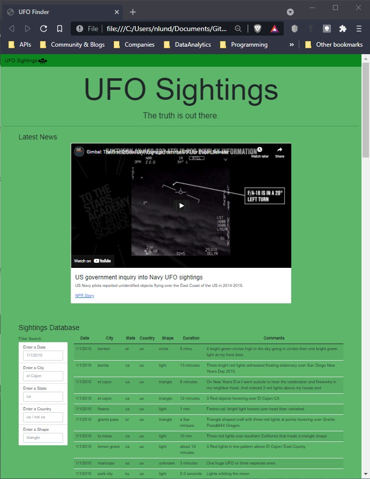
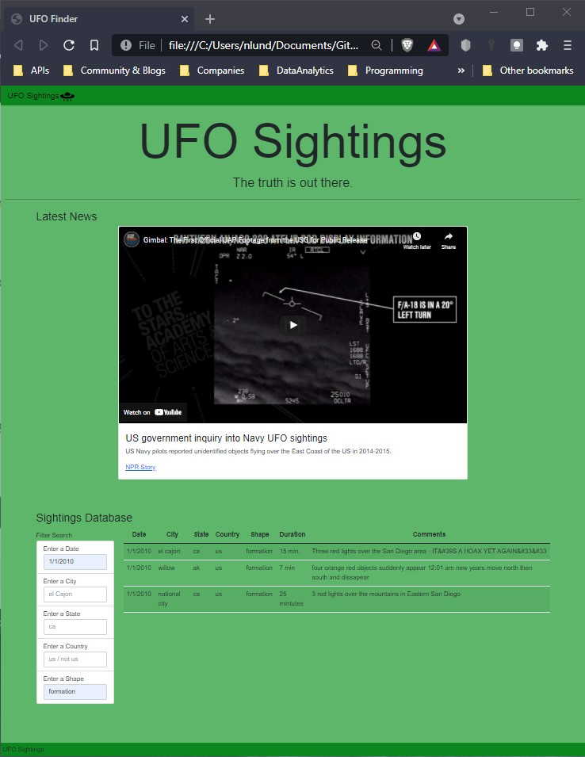

# javascript-filters

UofA Data Analytics Bootcamp Homework Assignment 14-Intro-To_Javascript

### Assignment Description

Build a responsive webpage that filters table data according to the users input.

### Run Instructions
* Open the level 1 or level 2 index.html.
* Review the latest UFO news.
* Search the UFO sightings database by entering search criteria. 

### Tools Utilized
| Webpage | User Interface |
|----------|----------|
| HTML | D3.js |
| Bootstrap |  |

### Source Data and Starter Code
* Provided by UofA Data Analytics Bootcamp

### Project Content Descriptions
* a_assignment_instructions: Instructions, data and starter code for completing the assignment.
* b_UFO_level_1: Webpage with one search filter.
* c_UFO_level_2: Webpage with multiple search filters.
* d_images: Webpage screenshots.

## Completed webpage
Inital Webpage load

Webpage after user selections

